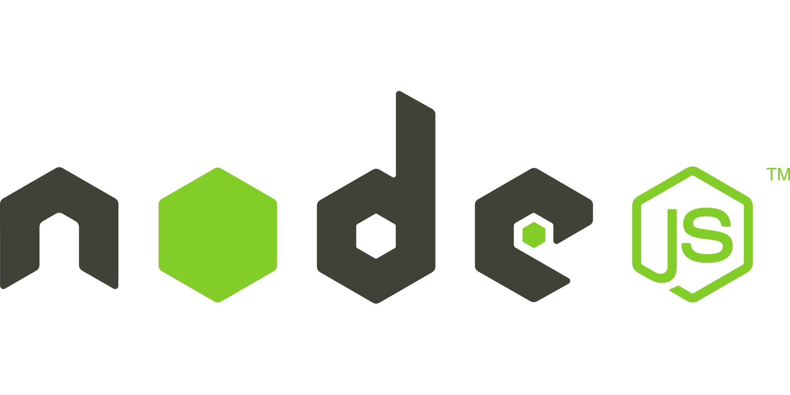
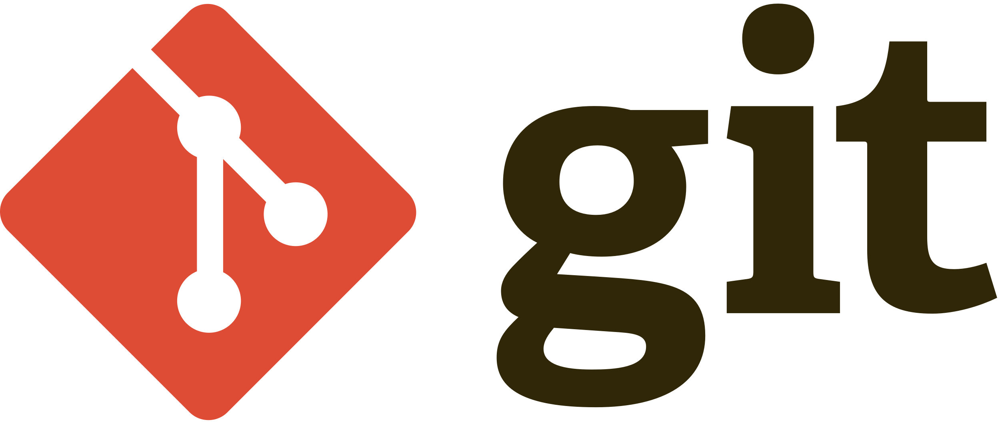
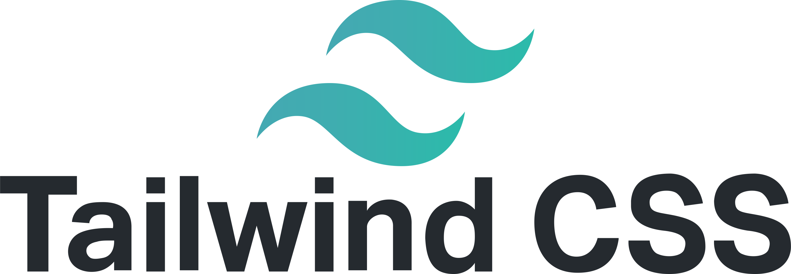

## About ME 🎯

```csharp
    Human Information
    ------------------------------------------
    Name: Elian
    Lastname: Rehbani
    Nickname: ERehbani
    Gender: Male
    Age: 22
    Languages: ["Spanish", "English US", "English UK"]
    Country: Argentina
    Experience: ["Gravitad", "TickCorp", "useTeam"]

Hello! I'm Elian 🇦🇷. I am passionate about programming and I always
focus on learning new technologies or expanding my current knowledge in order to achieve new options for
projects to carryout in my future.
 As a dedicated person I am usually self-demanding and always try to improve any area of ​​my projects
so that the UI/UX is even better.
```

<br>

<p align="center">
  <a href="https://www.linkedin.com/in/elianrehbani" alt="Join our community" target="_blank"></a>
  &#8287;&#8287;&#8287;&#8287;&#8287;
</p>

<br>

## Tecnologies 👨‍💻
<div align="center">
    <table align="left">
        <tr>
            <td align="center" width="140" height="112.43">
                
                <br /> NodeJS
            </td>
            <td align="center" width="140" height="112.43">
                
                <br /> Javascript
            </td>
            <td align="center" width="140" height="112.43">
                
                <br /> ReactJS - Redux
            </td>
        </tr>
        <tr>
            <td align="center" width="140" height="112.43">
                
                <br /> SQL
            </td>
            <td align="center" width="140" height="112.43">
                
                <br /> GIT
            </td>
            <td align="center" width="140" height="112.43">
                
                <br /> ExpressJS
            </td>
        </tr>
        <tr>
            <td align="center" width="140" height="112.43">
                
                <br /> CSS
            </td>
            <td align="center" width="140" height="112.43">
                
                <br /> Tailwind CSS
            </td>
            <td align="center" width="140" height="112.43">
                
                <br /> Jest
            </td>
        </tr>
        <tr>
            <td align="center" width="140" height="112.43">
                
                <br /> HTML
            </td>
        </tr>
    </table>
    
</div>

<br>

## Softwares 💻
<div align="center">
    <table align="left">
        <tr>
            <td align="center" width="140" height="112.43">
                
                <br /> VSCode
            </td>
            <td align="center" width="140" height="112.43">
                
                <br /> Figma
            </td>
            <td align="center" width="140" height="112.43">
                
                <br /> Notion
            </td>
        </tr>
    </table>
</div>
